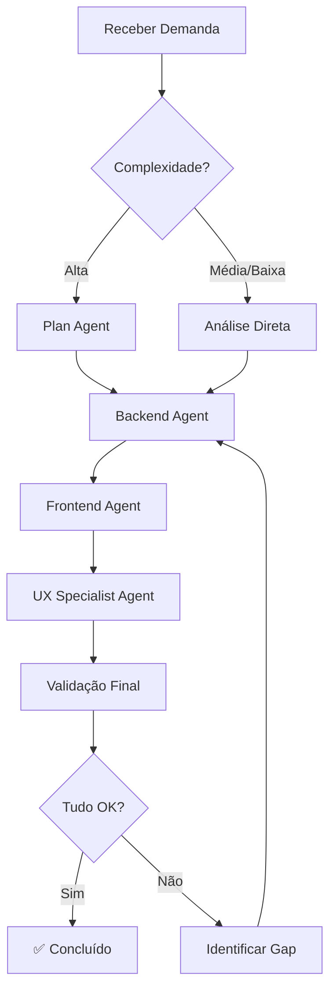

# 🎯 Sistema de Orquestração de Agentes

Este documento define o processo coordenado entre agentes especializados (Frontend, Backend, UX) para garantir **zero erros** e **consistência total** em todas as mudanças do sistema.

---

## 📋 Palavras-Chave e Comandos

Use estas palavras-chave para ativar o modo de orquestração coordenada:

### Comando Principal
```
🔄 FULL-STACK [tipo-de-mudança]
```

### Tipos de Mudança Suportados

1. **`🔄 FULL-STACK ADD-FIELD`** - Adicionar novo campo a uma entidade
2. **`🔄 FULL-STACK NEW-FEATURE`** - Criar nova funcionalidade completa
3. **`🔄 FULL-STACK MODIFY-FLOW`** - Modificar fluxo existente
4. **`🔄 FULL-STACK FIX-INCONSISTENCY`** - Corrigir inconsistência de dados/fluxo
5. **`🔄 FULL-STACK REFACTOR`** - Refatorar funcionalidade existente

### Exemplos de Uso

```bash
# Adicionar campo "bairro" aos clientes
🔄 FULL-STACK ADD-FIELD: Adicionar campo "neighborhood" ao Customer

# Nova feature de envios condicionais
🔄 FULL-STACK NEW-FEATURE: Sistema de envios condicionais (try before you buy)

# Corrigir status não atualizando
🔄 FULL-STACK FIX-INCONSISTENCY: Status de envios não atualiza após ações
```

---

## 🏗️ Arquitetura de 3 Camadas

Toda mudança deve seguir a ordem:

```
1️⃣ BACKEND (Dados e Lógica)
   ↓
2️⃣ FRONTEND (Interface e Integração)
   ↓
3️⃣ UX (Refinamento e Experiência)
```

---

## 📝 Processo por Tipo de Mudança

### 1️⃣ ADD-FIELD (Adicionar Campo)

#### ✅ Checklist Backend
- [ ] Adicionar campo ao modelo SQLAlchemy (`backend/app/models/`)
- [ ] Adicionar campo ao schema Pydantic de criação (`*Create`)
- [ ] Adicionar campo ao schema Pydantic de atualização (`*Update`)
- [ ] Adicionar campo ao schema Pydantic de resposta (`*Response`)
- [ ] Criar migration Alembic: `alembic revision --autogenerate -m "add_field_x"`
- [ ] Executar migration: `alembic upgrade head`
- [ ] Atualizar repository se necessário (geralmente não precisa - BaseRepository cobre)
- [ ] Atualizar service se houver lógica específica
- [ ] Atualizar endpoint se necessário (normalmente já pega automaticamente)
- [ ] **Testar**: Criar, ler, atualizar com novo campo

#### ✅ Checklist Frontend
- [ ] Adicionar campo aos tipos TypeScript (`mobile/types/`)
- [ ] Adicionar estado no formulário de criação (`useState`)
- [ ] Adicionar estado no formulário de edição (`useState`)
- [ ] Adicionar `TextInput`/componente no formulário de criação
- [ ] Adicionar `TextInput`/componente no formulário de edição
- [ ] Adicionar campo ao payload de envio (criar/atualizar)
- [ ] Adicionar campo à exibição em detalhes (se aplicável)
- [ ] Adicionar campo à exibição em lista (se aplicável)
- [ ] Aplicar máscara/validação se necessário
- [ ] Testar fluxo completo: criar → visualizar → editar

#### ✅ Checklist UX
- [ ] Campo está no lugar correto (hierarquia visual)?
- [ ] Label é clara e descritiva?
- [ ] Placeholder ajuda o usuário?
- [ ] Validação aparece no momento certo?
- [ ] Campo está no card correto (agrupamento lógico)?
- [ ] Espaçamento consistente com outros campos?
- [ ] Acessibilidade: keyboardType adequado?
- [ ] Autocompletar funciona? (ex: CEP → endereço)

---

### 2️⃣ NEW-FEATURE (Nova Funcionalidade)

#### 🎯 Fase 1: Planejamento (UX + Plan Agent)
```bash
Use: Task tool com subagent_type="Plan"
```

- [ ] Definir requisitos funcionais
- [ ] Mapear entidades envolvidas
- [ ] Desenhar fluxo de usuário (UX)
- [ ] Identificar telas necessárias
- [ ] Listar endpoints API necessários
- [ ] Definir modelos de dados
- [ ] Identificar dependências com outras features
- [ ] Criar protótipo de navegação

#### 🔨 Fase 2: Backend (Backend Agent)
```bash
Use: Task tool com subagent_type="backend-master"
```

**Ordem de Implementação:**
1. **Modelos** (`backend/app/models/`)
   - [ ] Criar modelo SQLAlchemy
   - [ ] Definir relacionamentos
   - [ ] Adicionar propriedades calculadas
   - [ ] Implementar soft delete

2. **Schemas** (`backend/app/schemas/`)
   - [ ] Schema de criação (`*Create`)
   - [ ] Schema de atualização (`*Update`)
   - [ ] Schema de resposta (`*Response`)
   - [ ] Schema de listagem (`*ListResponse`)
   - [ ] Schemas auxiliares (DTOs)

3. **Repository** (`backend/app/repositories/`)
   - [ ] Criar repository extendendo `BaseRepository`
   - [ ] Adicionar métodos customizados se necessário
   - [ ] Implementar queries complexas

4. **Service** (`backend/app/services/`)
   - [ ] Criar service com lógica de negócio
   - [ ] Implementar validações
   - [ ] Orquestrar múltiplos repositories
   - [ ] Gerenciar transações

5. **Endpoints** (`backend/app/api/v1/endpoints/`)
   - [ ] Criar router
   - [ ] Implementar CRUD completo
   - [ ] Adicionar filtros e paginação
   - [ ] Documentar com docstrings
   - [ ] Aplicar autenticação/autorização

6. **Migration**
   - [ ] Criar: `alembic revision --autogenerate -m "add_feature_x"`
   - [ ] Revisar SQL gerado
   - [ ] Executar: `alembic upgrade head`

7. **Testes**
   - [ ] Testes unitários do service
   - [ ] Testes de integração dos endpoints
   - [ ] Testes de edge cases

#### 🎨 Fase 3: Frontend (React Native Agent)
```bash
Use: Task tool com subagent_type="react-native-frontend-master"
```

**Ordem de Implementação:**
1. **Tipos** (`mobile/types/`)
   - [ ] Definir interfaces TypeScript
   - [ ] Criar tipos auxiliares
   - [ ] Definir constantes (labels, cores, ícones)

2. **Services** (`mobile/services/`)
   - [ ] Criar service API
   - [ ] Implementar todas as chamadas HTTP
   - [ ] Adicionar tratamento de erros
   - [ ] Adicionar helpers

3. **Componentes Reutilizáveis** (`mobile/components/`)
   - [ ] Criar componentes específicos da feature
   - [ ] Seguir padrões UI do projeto
   - [ ] Adicionar prop types

4. **Telas** (`mobile/app/`)
   - [ ] Criar arquivo de rota
   - [ ] Implementar listagem
   - [ ] Implementar detalhes
   - [ ] Implementar criação
   - [ ] Implementar edição

5. **Integração React Query**
   - [ ] Queries para listagem
   - [ ] Query para detalhes
   - [ ] Mutation para criar
   - [ ] Mutation para atualizar
   - [ ] Mutation para deletar
   - [ ] Invalidação correta de cache

6. **Navegação**
   - [ ] Configurar rotas no Expo Router
   - [ ] Adicionar tab/drawer se necessário
   - [ ] Testar navegação entre telas

#### 💎 Fase 4: Refinamento UX (UX Specialist Agent)
```bash
Use: Task tool com subagent_type="mobile-ux-specialist"
```

- [ ] Revisar hierarquia visual
- [ ] Ajustar espaçamentos (seguir padrão: 4, 8, 12, 16, 24, 32)
- [ ] Remover dividers desnecessários
- [ ] Garantir feedback visual (loading, sucesso, erro)
- [ ] Adicionar estados vazios com ícones e mensagens
- [ ] Verificar acessibilidade (contraste, tamanho de toque)
- [ ] Otimizar performance (lazy loading, memoização)
- [ ] Testar fluxo em dispositivo real

---

### 3️⃣ MODIFY-FLOW (Modificar Fluxo)

#### 📊 Análise Prévia
- [ ] Mapear fluxo atual
- [ ] Identificar pontos de mudança
- [ ] Verificar impacto em outras features
- [ ] Listar telas/endpoints afetados

#### 🔄 Implementação
**Seguir mesma ordem: Backend → Frontend → UX**

- [ ] Atualizar service layer (backend)
- [ ] Atualizar endpoints se necessário
- [ ] Atualizar mutations/queries (frontend)
- [ ] Atualizar navegação entre telas
- [ ] Ajustar validações
- [ ] Testar casos extremos

---

### 4️⃣ FIX-INCONSISTENCY (Corrigir Inconsistência)

#### 🔍 Investigação
- [ ] Reproduzir o problema
- [ ] Identificar camada com problema (backend/frontend/ambos)
- [ ] Verificar dados no banco
- [ ] Verificar logs da API
- [ ] Verificar console do mobile

#### 🛠️ Correção por Camada

**Backend:**
- [ ] Verificar schema Pydantic (campos faltando?)
- [ ] Verificar repository (query retornando dados corretos?)
- [ ] Verificar service (lógica de negócio correta?)
- [ ] Verificar endpoint (resposta no formato correto?)
- [ ] Adicionar logs se necessário

**Frontend:**
- [ ] Verificar tipos TypeScript (match com backend?)
- [ ] Verificar service (parseando resposta corretamente?)
- [ ] Verificar invalidação de cache
- [ ] Verificar estados do componente
- [ ] Adicionar tratamento de erro

**Sincronia:**
- [ ] Comparar schema backend vs tipo frontend
- [ ] Comparar nomes de campos (snake_case vs camelCase)
- [ ] Verificar transformações de dados
- [ ] Testar fluxo completo end-to-end

---

## 🎯 Checklist Universal (Toda Mudança)

Independente do tipo, **SEMPRE** verificar:

### ✅ Backend
- [ ] Migration criada e executada
- [ ] Schemas Pydantic completos e consistentes
- [ ] Service layer segue 3-layer architecture
- [ ] Soft delete implementado (nunca hard delete)
- [ ] Endpoints documentados
- [ ] Autenticação/autorização aplicada
- [ ] Validações de negócio implementadas
- [ ] Tratamento de erros adequado

### ✅ Frontend
- [ ] Tipos TypeScript sincronizados com backend
- [ ] React Query usado corretamente
- [ ] Invalidação de cache após mutations
- [ ] Loading states implementados
- [ ] Error handling implementado
- [ ] Validação de formulários
- [ ] Navegação funcionando
- [ ] Dados exibidos corretamente

### ✅ UX/UI
- [ ] Seguir padrões de design do projeto
- [ ] Sem dividers desnecessários
- [ ] Espaçamentos consistentes
- [ ] Feedback visual adequado
- [ ] Estados vazios com mensagem clara
- [ ] Hierarquia visual correta
- [ ] Acessibilidade (contraste, tamanho)
- [ ] Testado em dispositivo real

### ✅ Documentação
- [ ] CLAUDE.md atualizado se padrão mudou
- [ ] Comentários inline onde necessário
- [ ] Docstrings em funções complexas
- [ ] README atualizado se necessário

---

## 🤖 Protocolo de Comunicação entre Agentes

### Quando usar cada agente:

#### 🎨 **mobile-ux-specialist**
**USE QUANDO:**
- Criar/modificar telas mobile
- Revisar design de componentes
- Garantir consistência visual
- Melhorar fluxo de usuário
- Trabalhar com navegação (Expo Router)

**NÃO USE PARA:**
- Implementar lógica de negócio
- Criar endpoints backend
- Escrever queries SQL

#### ⚛️ **react-native-frontend-master**
**USE QUANDO:**
- Implementar componentes React Native
- Integrar com React Query
- Criar services de API (Axios)
- Trabalhar com estados (Zustand/useState)
- Implementar formulários

**NÃO USE PARA:**
- Mudanças no backend
- Decisões de design/UX
- Criar modelos de dados

#### 🔧 **backend-master**
**USE QUANDO:**
- Criar/modificar modelos SQLAlchemy
- Implementar service layer
- Criar endpoints FastAPI
- Escrever repositories
- Trabalhar com banco de dados
- Criar migrations Alembic

**NÃO USE PARA:**
- Mudanças no frontend
- Componentes React Native
- Navegação mobile

#### 📋 **Plan**
**USE QUANDO:**
- Planejar features complexas
- Arquitetar solução
- Identificar dependências
- Quebrar em subtarefas
- Decidir approach técnico

**NÃO USE PARA:**
- Implementação direta
- Mudanças simples/óbvias

### Ordem de Execução Recomendada:



---

## 🚨 Sinais de Alerta (Red Flags)

Se você ver isso, **PARE** e corrija:

### ❌ Backend
- [ ] Modelos sem soft delete (`is_active`)
- [ ] Hard delete no código
- [ ] Lógica de negócio no repository
- [ ] Queries SQL diretas no endpoint
- [ ] Schemas Pydantic incompletos
- [ ] Endpoints sem autenticação
- [ ] Migrations não criadas

### ❌ Frontend
- [ ] Tipos não sincronizados com backend
- [ ] Fetch direto sem React Query
- [ ] Cache não invalidado após mutation
- [ ] Sem loading/error states
- [ ] Campos sem validação
- [ ] Navegação quebrada
- [ ] Dados hardcoded

### ❌ UX
- [ ] Botões fixos com position absolute (use scroll)
- [ ] Dividers desnecessários
- [ ] Espaçamentos inconsistentes
- [ ] Sem feedback visual
- [ ] Estados vazios sem mensagem
- [ ] Campos sem label/placeholder
- [ ] Hierarquia visual confusa

---

## 📚 Referências Rápidas

### Estrutura do Projeto
```
fitness-store-management/
├── backend/
│   ├── app/
│   │   ├── models/          # SQLAlchemy models
│   │   ├── schemas/         # Pydantic schemas
│   │   ├── repositories/    # Data access
│   │   ├── services/        # Business logic
│   │   └── api/v1/endpoints # FastAPI routes
│   └── alembic/versions/    # Migrations
│
└── mobile/
    ├── app/                 # Screens (Expo Router)
    ├── components/          # Reusable components
    ├── services/            # API services (Axios)
    ├── types/               # TypeScript types
    ├── store/               # Zustand stores
    └── hooks/               # Custom hooks
```

### Padrões de Código

**Backend (Python):**
- snake_case para variáveis/funções
- PascalCase para classes
- Async/await obrigatório
- Type hints em tudo

**Frontend (TypeScript):**
- camelCase para variáveis/funções
- PascalCase para componentes/tipos
- Hooks no topo do componente
- Destructure props

**Estilos (React Native):**
- Usar theme do projeto (`Colors.light.*`, `theme.spacing.*`)
- StyleSheet.create no final do arquivo
- Evitar inline styles

---

## 🎓 Treinamento dos Agentes

### Instruções para Claude em Novas Sessões:

Quando ver `🔄 FULL-STACK`, siga este protocolo:

1. **Leia AGENT_ORCHESTRATION.md** primeiro
2. **Identifique o tipo** de mudança (ADD-FIELD, NEW-FEATURE, etc)
3. **Siga a checklist** correspondente
4. **Use os agentes** na ordem correta
5. **Valide cada camada** antes de seguir
6. **Teste end-to-end** antes de concluir

### Template de Resposta:

```markdown
🔄 **FULL-STACK [TIPO] INICIADO**

## 📋 Plano de Execução
- [ ] Backend (models → schemas → repository → service → endpoint)
- [ ] Frontend (types → services → components → screens)
- [ ] UX (review → ajustes → validação)

## 🎯 Status Atual
- ✅ Backend: [COMPLETO/EM ANDAMENTO/PENDENTE]
- ⏳ Frontend: [COMPLETO/EM ANDAMENTO/PENDENTE]
- ⏳ UX: [COMPLETO/EM ANDAMENTO/PENDENTE]

## 🔍 Validações
- [ ] Migration executada
- [ ] Tipos sincronizados
- [ ] Cache invalidado
- [ ] Testado end-to-end
```

---

## 💡 Exemplos Práticos

### Exemplo 1: Adicionar Campo "Bairro"

**Comando:**
```
🔄 FULL-STACK ADD-FIELD: Adicionar campo "neighborhood" ao modelo Customer
```

**Execução:**
1. ✅ Backend: Campo adicionado a Customer model, schemas, migration criada
2. ✅ Frontend: Campo adicionado a types, formulários de criar/editar
3. ✅ UX: Campo posicionado após "Número", integrado com busca CEP
4. ✅ Validação: Testado criar → visualizar → editar

### Exemplo 2: Nova Feature de Envios

**Comando:**
```
🔄 FULL-STACK NEW-FEATURE: Sistema de envios condicionais (try before you buy)
```

**Execução:**
1. 📋 Plan: Mapear entidades, fluxos, telas necessárias
2. 🔧 Backend: Models (ConditionalShipment, ConditionalShipmentItem) + Services + Endpoints
3. ⚛️ Frontend: Telas (listagem, criar, detalhes) + Services + React Query
4. 🎨 UX: Refinamento de fluxo, ajuste de botões, feedback visual
5. ✅ Validação: Teste completo do fluxo

---

## 🎯 Meta: Zero Retrabalho

**Checklist Final antes de Marcar como Completo:**

- [ ] Todos os 3 agentes (Backend, Frontend, UX) revisaram
- [ ] Nenhum warning no console
- [ ] Nenhum erro no TypeScript
- [ ] Backend responde corretamente
- [ ] Frontend exibe dados corretamente
- [ ] Navegação funciona
- [ ] Loading states implementados
- [ ] Error handling implementado
- [ ] Testado em dispositivo real
- [ ] Código commitado com mensagem clara

**Só marque como COMPLETO se TUDO estiver ✅**

---

## 📞 Suporte

Se encontrar inconsistências ou erros após seguir este processo:
1. Documente o erro encontrado
2. Identifique qual camada falhou
3. Revise a checklist correspondente
4. Corrija e atualize este documento se necessário

**Este documento é vivo e deve evoluir com o projeto!**
