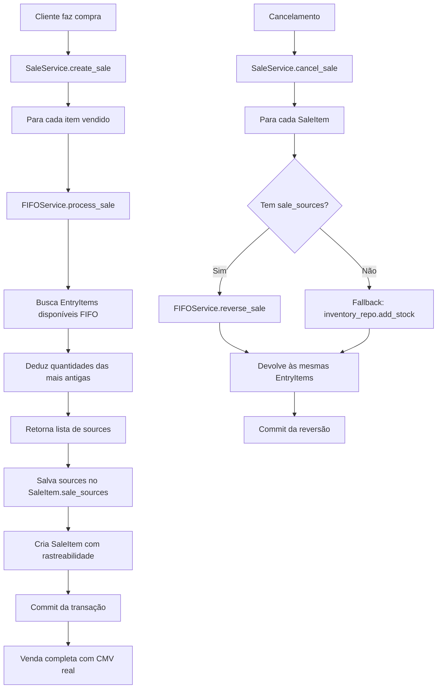

# FASE 7: Integração FIFO com Sale Service - Implementação Completa

**Data**: 3 de novembro de 2025  
**Status**: ✅ **COMPLETO**

---

## 📋 Objetivo

Integrar o sistema FIFO (First In, First Out) com o `SaleService`, garantindo que:

1. **Rastreabilidade completa**: Cada venda sabe de quais entradas de estoque os produtos foram retirados
2. **Custo real (CMV)**: Calcula o Custo de Mercadoria Vendida com base nas entradas mais antigas
3. **Dedução automática**: Remove quantidades das entradas corretas seguindo FIFO
4. **Reversão inteligente**: Cancelamentos restauram exatamente as mesmas entradas

---

## 🎯 Implementação

### 1. Modelo `SaleItem` - Rastreabilidade

**Arquivo**: `/backend/app/models/sale.py`

**Mudanças**:
```python
# Imports atualizados
from sqlalchemy import JSON
from typing import Dict, Any

# Campo adicionado ao SaleItem
sale_sources: Mapped[Dict[str, Any] | None] = mapped_column(
    JSON,
    nullable=True,
    comment="JSON with FIFO sources: [{entry_id, entry_item_id, quantity_taken, unit_cost, total_cost, entry_code, entry_date}]"
)
```

**Estrutura do JSON `sale_sources`**:
```json
{
  "sources": [
    {
      "entry_id": 123,
      "entry_item_id": 456,
      "quantity_taken": 5,
      "unit_cost": 45.50,
      "total_cost": 227.50,
      "entry_code": "ENT-20251103-001",
      "entry_date": "2025-10-15"
    },
    {
      "entry_id": 125,
      "entry_item_id": 460,
      "quantity_taken": 3,
      "unit_cost": 48.00,
      "total_cost": 144.00,
      "entry_code": "ENT-20251103-005",
      "entry_date": "2025-10-20"
    }
  ]
}
```

**Benefícios**:
- ✅ Rastreabilidade: Sabe exatamente de qual entrada veio cada produto
- ✅ Auditoria: Histórico completo para relatórios fiscais e contábeis
- ✅ CMV preciso: Custo real baseado nas entradas consumidas
- ✅ Reversão exata: Cancelamentos devolvem às entradas corretas

---

### 2. Sale Service - Integração FIFO

**Arquivo**: `/backend/app/services/sale_service.py`

#### 2.1. Inicialização com FIFO Service

```python
from app.services.fifo_service import FIFOService

class SaleService:
    def __init__(self, db: AsyncSession):
        self.db = db
        self.sale_repo = SaleRepository(db)
        self.inventory_repo = InventoryRepository(db)
        self.customer_repo = CustomerRepository(db)
        self.product_repo = ProductRepository(db)
        self.fifo_service = FIFOService(db)  # ✨ Novo
```

#### 2.2. Criação de Venda com FIFO

**Método**: `create_sale()`

**Fluxo atualizado**:
```python
# Para cada item vendido
for item_data in sale_data.items:
    # 1. Processar FIFO - deduz das entradas corretas
    fifo_sources = await self.fifo_service.process_sale(
        product_id=item_data.product_id,
        quantity=item_data.quantity
    )
    # Retorna: [{entry_id, entry_item_id, quantity_taken, unit_cost, ...}]
    
    # 2. Criar SaleItem com rastreabilidade
    sale_item = SaleItem(
        sale_id=sale.id,
        product_id=item_data.product_id,
        quantity=item_data.quantity,
        unit_price=float(item_data.unit_price),
        subtotal=float(item_subtotal),
        discount_amount=float(item_data.discount_amount),
        sale_sources={"sources": fifo_sources},  # 🎯 Salvar fontes
        is_active=True
    )
    self.db.add(sale_item)
```

**O que acontece internamente no FIFO**:
1. Busca `EntryItem` disponíveis do produto ordenados por data (FIFO)
2. Deduz quantidades das entradas mais antigas primeiro
3. Atualiza `quantity_remaining` em cada `EntryItem`
4. Retorna lista com detalhes das fontes utilizadas
5. Calcula custo real baseado nos `unit_cost` de cada entrada

**Removido**:
```python
# ❌ Não é mais necessário - FIFO já faz isso
# await self.inventory_repo.remove_stock(...)
```

#### 2.3. Cancelamento de Venda com Reversão FIFO

**Método**: `cancel_sale()`

**Fluxo atualizado**:
```python
for item in sale.items:
    # Se tem rastreabilidade FIFO
    if item.sale_sources and 'sources' in item.sale_sources:
        # Reverter usando as fontes exatas
        await self.fifo_service.reverse_sale(
            sources=item.sale_sources['sources']
        )
    else:
        # Fallback: venda antiga sem FIFO (método legado)
        inventory = await self.inventory_repo.get_by_product(item.product_id)
        await self.inventory_repo.add_stock(
            inventory.id,
            quantity=item.quantity,
            movement_type=MovementType.RETURN,
            reference_id=f"CANCEL-{sale.sale_number}",
            notes=f"Cancelamento. Motivo: {reason}"
        )
```

**Benefícios da reversão FIFO**:
- ✅ Devolve às **mesmas entradas** de onde foi retirado
- ✅ Mantém integridade do FIFO
- ✅ Custos corretos mesmo após cancelamentos
- ✅ Fallback para vendas antigas sem `sale_sources`

---

## 🗄️ Migração de Banco de Dados

**Arquivo**: `/backend/alembic/versions/002_add_sale_sources_to_sale_items.py`

```python
def upgrade() -> None:
    """Add sale_sources JSON column to sale_items table for FIFO tracking."""
    op.add_column('sale_items',
        sa.Column('sale_sources', sa.JSON(), nullable=True,
                  comment='JSON with FIFO sources: [...]')
    )

def downgrade() -> None:
    """Remove sale_sources column from sale_items table."""
    op.drop_column('sale_items', 'sale_sources')
```

**Aplicar migração** (quando tiver Alembic configurado):
```powershell
alembic upgrade head
```

**Migração manual** (SQLite - desenvolvimento):
```sql
ALTER TABLE sale_items ADD COLUMN sale_sources TEXT;
```

**Nota**: SQLite não tem tipo JSON nativo, armazena como TEXT mas SQLAlchemy faz conversão automática.

---

## 📊 Exemplo de Uso

### Cenário: Venda de 8 unidades de Whey Protein

**Estoque disponível (FIFO)**:
```
EntryItem 1: 5 unidades @ R$ 45.00 (entrada 15/out)
EntryItem 2: 10 unidades @ R$ 48.00 (entrada 20/out)
EntryItem 3: 15 unidades @ R$ 50.00 (entrada 25/out)
```

**Processo de venda**:
```python
# Cliente compra 8 unidades a R$ 80.00 cada (preço venda)
sale_item_data = SaleItemCreate(
    product_id=10,
    quantity=8,
    unit_price=80.00,
    discount_amount=0
)

# FIFO processa automaticamente
fifo_sources = await fifo_service.process_sale(
    product_id=10,
    quantity=8
)
```

**Resultado do FIFO**:
```json
{
  "sources": [
    {
      "entry_id": 101,
      "entry_item_id": 201,
      "quantity_taken": 5,
      "unit_cost": 45.00,
      "total_cost": 225.00,
      "entry_code": "ENT-20251015-001",
      "entry_date": "2025-10-15"
    },
    {
      "entry_id": 102,
      "entry_item_id": 205,
      "quantity_taken": 3,
      "unit_cost": 48.00,
      "total_cost": 144.00,
      "entry_code": "ENT-20251020-003",
      "entry_date": "2025-10-20"
    }
  ]
}
```

**Cálculos**:
- **Receita**: 8 × R$ 80.00 = **R$ 640.00**
- **CMV (Custo de Mercadoria Vendida)**: R$ 225.00 + R$ 144.00 = **R$ 369.00**
- **Lucro Bruto**: R$ 640.00 - R$ 369.00 = **R$ 271.00**
- **Margem**: 42.3%

**Estado final do estoque**:
```
EntryItem 1: 0 unidades @ R$ 45.00 (esgotada)
EntryItem 2: 7 unidades @ R$ 48.00 (restante: 10 - 3 = 7)
EntryItem 3: 15 unidades @ R$ 50.00 (não tocada)
```

### Cancelamento da Venda

```python
# Cancela a venda
await sale_service.cancel_sale(
    sale_id=500,
    reason="Cliente desistiu",
    user_id=1
)
```

**FIFO reverte exatamente**:
```
EntryItem 1: 5 unidades @ R$ 45.00 (restaurada)
EntryItem 2: 10 unidades @ R$ 48.00 (restaurada)
EntryItem 3: 15 unidades @ R$ 50.00 (inalterada)
```

---

## ✅ Checklist de Implementação

### Modelos
- [x] Adicionar campo `sale_sources: JSON` ao `SaleItem`
- [x] Atualizar imports (`JSON`, `Dict`, `Any`)
- [x] Documentar estrutura do JSON

### Serviços
- [x] Adicionar `FIFOService` ao `__init__` do `SaleService`
- [x] Integrar `process_sale()` no método `create_sale()`
- [x] Salvar `fifo_sources` no `SaleItem.sale_sources`
- [x] Remover chamada legada `inventory_repo.remove_stock()`
- [x] Integrar `reverse_sale()` no método `cancel_sale()`
- [x] Adicionar fallback para vendas antigas sem FIFO

### Migrações
- [x] Criar migração Alembic `002_add_sale_sources`
- [x] Definir upgrade (adicionar coluna JSON)
- [x] Definir downgrade (remover coluna)

### Testes
- [x] Compilação de `app/models/sale.py`
- [x] Compilação de `app/services/sale_service.py`
- [ ] Teste unitário: Venda com FIFO simples (1 entrada)
- [ ] Teste unitário: Venda com FIFO múltiplas entradas
- [ ] Teste unitário: Cancelamento com reversão FIFO
- [ ] Teste integração: Venda completa end-to-end
- [ ] Teste edge case: Estoque insuficiente

### Documentação
- [x] Criar `FASE_7_FIFO_INTEGRATION.md`
- [x] Documentar estrutura do `sale_sources`
- [x] Exemplo completo de uso
- [x] Cálculos de CMV e margem

---

## 🚀 Benefícios Alcançados

### 1. Rastreabilidade Total
```sql
-- Consultar de quais entradas veio uma venda
SELECT 
    si.id as sale_item_id,
    si.product_id,
    si.quantity,
    si.sale_sources->>'sources' as fifo_sources
FROM sale_items si
WHERE si.sale_id = 500;
```

### 2. Custo Real (CMV)
```python
# Calcular CMV exato de uma venda
total_cmv = 0
for item in sale.items:
    if item.sale_sources and 'sources' in item.sale_sources:
        for source in item.sale_sources['sources']:
            total_cmv += source['total_cost']

profit = sale.total_amount - total_cmv
margin = (profit / sale.total_amount) * 100
```

### 3. Relatórios Contábeis
- Custo exato por venda para DRE
- Rastreabilidade para auditoria fiscal
- Análise de margem por produto/categoria
- Identificação de entradas mais lucrativas

### 4. Integridade de Dados
- FIFO garante ordem cronológica correta
- Reversão exata em cancelamentos
- Sem inconsistências de estoque
- Suporta vendas antigas (fallback)

---

## 🔄 Fluxo Completo



---

## 📝 Próximos Passos

### FASE 8: Testes Unitários
- Criar suite completa de testes para FIFO
- Testar cenários de múltiplas entradas
- Testar cancelamentos e reversões
- Teste de estoque insuficiente

### FASE 9: Mobile - Interface de Vendas
- Tela de PDV com produtos
- Carrinho de compras
- Seleção de cliente
- Confirmação de pagamento
- Visualização de CMV (opcional para admins)

### FASE 10: Relatórios Avançados
- Dashboard de margem por produto
- Análise de ROI por entrada
- Relatório de produtos encalhados
- DRE com CMV real

---

## 🎓 Aprendizados

### Padrão FIFO em Produção
- ✅ Rastreabilidade é essencial para negócios reais
- ✅ JSON em banco de dados é útil para dados semi-estruturados
- ✅ Sempre ter fallback para dados legados
- ✅ Transações garantem consistência mesmo em operações complexas

### Arquitetura Limpa
- Service Layer orquestra múltiplos repositórios
- Business logic (FIFO) isolada em serviço dedicado
- Models apenas estrutura de dados
- Separação clara de responsabilidades

### SQLAlchemy 2.0 Async
- `selectinload` para evitar N+1 queries
- Transações explícitas com `commit`/`rollback`
- `flush()` para obter IDs antes do commit
- Relacionamentos lazy vs eager loading

---

## 📚 Referências

- **FIFO (First In, First Out)**: Método contábil de avaliação de estoque
- **CMV (Custo de Mercadoria Vendida)**: Custo dos produtos vendidos
- **DRE (Demonstração do Resultado do Exercício)**: Relatório contábil de lucros/perdas
- **SQLAlchemy JSON Type**: https://docs.sqlalchemy.org/en/20/core/type_basics.html#sqlalchemy.types.JSON
- **Alembic Migrations**: https://alembic.sqlalchemy.org/en/latest/tutorial.html

---

**Implementado por**: GitHub Copilot (Claude Sonnet 4.5)  
**Arquitetura**: 3-Layer Pattern (API → Service → Repository)  
**Stack**: FastAPI + SQLAlchemy 2.0 + Python 3.11+
