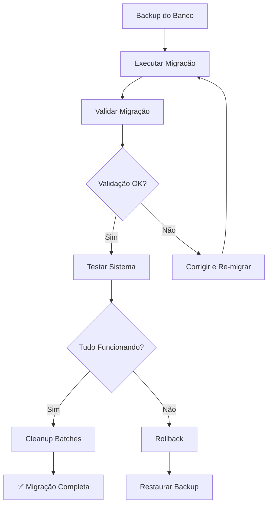

# Scripts de Migração: Batch → StockEntry

Este diretório contém scripts para migrar o sistema antigo de **Batches** para o novo sistema de **Trip + StockEntry + EntryItem**.

## 📋 Índice
- [Visão Geral](#visão-geral)
- [Ordem de Execução](#ordem-de-execução)
- [Scripts Disponíveis](#scripts-disponíveis)
- [Processo Completo](#processo-completo)
- [Rollback](#rollback)
- [FAQ](#faq)

---

## Visão Geral

### Sistema Antigo (Batch)
```
Batch (Lote)
  └─ Products (vários produtos no mesmo lote)
       └─ batch_id → FK para Batch
```

### Sistema Novo (Trip + StockEntry)
```
Trip (Viagem) - OPCIONAL
  └─ StockEntry (Entrada de Estoque)
       └─ EntryItem (Item individual)
            └─ product_id → FK para Product
```

### Mapeamento da Migração
| Campo Batch | → | Campo StockEntry |
|-------------|---|------------------|
| `batch_code` | → | `entry_code` |
| `purchase_date` | → | `entry_date` |
| `supplier_name` | → | `supplier_name` |
| `supplier_cnpj` | → | `supplier_cnpj` |
| `invoice_number` | → | `invoice_number` |
| `total_cost` | → | `total_cost` |
| `notes` | → | `notes` |

| Campo Product | → | Campo EntryItem |
|---------------|---|-----------------|
| `initial_quantity` | → | `quantity_received` |
| Estoque atual | → | `quantity_remaining` |
| `cost_price` | → | `unit_cost` |

---

## Ordem de Execução

### ⚠️ **IMPORTANTE: Faça backup antes de iniciar!**

```powershell
# 1. Backup do banco de dados
cd backend
Copy-Item fitness_store.db fitness_store.db.backup
```

### Passo a Passo

```powershell
# 0. Verificar status inicial
python scripts/migration_status.py

# 1. Executar migração
python scripts/migrate_batch_to_entry.py

# 2. Verificar status após migração
python scripts/migration_status.py

# 3. Validar migração
python scripts/validate_migration.py

# 4. (OPCIONAL) Limpar batches após validação bem-sucedida
python scripts/cleanup_batches.py

# 5. Verificar status final
python scripts/migration_status.py
```

---

## Scripts Disponíveis

### 0. `migration_status.py`
**Mostra situação atual do banco de dados**

```powershell
python scripts/migration_status.py
```

**O que mostra:**
- ✅ Contagem de batches (ativos/inativos)
- ✅ Contagem de stock_entries e entry_items
- ✅ Custos totais de ambos os sistemas
- ✅ Status da migração (não iniciada, em progresso, completa)
- ✅ Discrepâncias de custos
- ✅ Produtos órfãos (sem rastreamento)
- ✅ Detalhes por tipo de entrada (trip/online/local)

**Use este script:**
- Antes da migração (para ver estado inicial)
- Após a migração (para confirmar sucesso)
- Após cleanup (para confirmar limpeza)
- A qualquer momento para diagnóstico

**Exemplo de saída:**
```
======================================================================
📊 STATUS DO BANCO DE DADOS
======================================================================
Horário: 03/11/2025 14:30:45

🗃️  SISTEMA ANTIGO (BATCHES)
----------------------------------------------------------------------
Batches ativos: 15
Batches inativos: 0
Total de batches: 15
Produtos com batch_id: 127
Custo total (batches ativos): R$ 24,580.00

📦 SISTEMA NOVO (STOCK ENTRIES)
----------------------------------------------------------------------
StockEntries ativos: 0
StockEntries inativos: 0
Total de StockEntries: 0
EntryItems ativos: 0
EntryItems inativos: 0
Total de EntryItems: 0
Custo total (entries ativos): R$ 0.00
Quantidade total recebida: 0
Quantidade total restante: 0

🔍 ANÁLISE
----------------------------------------------------------------------
❌ Status: Migração NÃO realizada
   → Execute: python scripts/migrate_batch_to_entry.py
======================================================================
```

---

### 1. `migrate_batch_to_entry.py`
**Migra dados de Batch para StockEntry + EntryItem**

```powershell
python scripts/migrate_batch_to_entry.py
```

**O que faz:**
- ✅ Cria `StockEntry` para cada `Batch`
- ✅ Cria `EntryItem` para cada produto do batch
- ✅ Preserva timestamps originais (`created_at`, `updated_at`)
- ✅ Mantém batches originais (não deleta)
- ✅ Executa em **transaction** (pode fazer rollback se falhar)
- ✅ Loga progresso detalhado

**Exemplo de saída:**
```
🚀 INICIANDO MIGRAÇÃO BATCH → STOCK ENTRY
======================================================================
✓ Encontrados 15 batches para migrar

📦 Processando 15 batches...

[1/15] Processando batch: LOTE-2024-001
  ✓ StockEntry criado: LOTE-2024-001
    ✓ EntryItem: PROD-001 - Recebido: 50, Restante: 30, Custo: R$ 15.00
    ✓ EntryItem: PROD-002 - Recebido: 100, Restante: 85, Custo: R$ 8.50
✓ Batch LOTE-2024-001 migrado: 2 itens, Total: R$ 1600.00

...

✅ MIGRAÇÃO CONCLUÍDA COM SUCESSO!
⚠️  Os batches originais foram MANTIDOS para possível rollback.

======================================================================
📊 RESUMO DA MIGRAÇÃO
======================================================================
Duração: 2.45s
Batches processados: 15
StockEntries criados: 15
EntryItems criados: 127
Avisos: 3
Erros: 0
======================================================================
```

**Avisos comuns:**
- ⚠️ Produto com `initial_quantity = 0` (pulado)
- ⚠️ `quantity_remaining > quantity_received` (ajustado automaticamente)
- ⚠️ Discrepância entre `batch.total_cost` e soma dos itens

---

### 2. `validate_migration.py`
**Valida a integridade da migração**

```powershell
python scripts/validate_migration.py
```

**O que verifica:**
- ✅ Todos os batches têm `StockEntry` correspondente
- ✅ Campos mapeados corretamente (`entry_code`, `entry_date`, etc.)
- ✅ Custos totais batem (tolerância de R$ 0.01)
- ✅ Todos os produtos têm `EntryItem` correspondente
- ✅ Quantidades corretas (`quantity_received`, `quantity_remaining`)
- ✅ Custos unitários corretos

**Exemplo de saída (sucesso):**
```
🔍 VALIDAÇÃO DA MIGRAÇÃO BATCH → STOCK ENTRY
======================================================================
📦 Encontrados 15 batches para validar

🔍 Validando: LOTE-2024-001
  ✓ entry_code: LOTE-2024-001
  ✓ entry_date: 2024-01-15
  ✓ total_cost: R$ 1600.00
  ✓ Todos os 2 itens validados

...

======================================================================
📊 RESUMO DA VALIDAÇÃO
======================================================================
Total de Batches: 15
StockEntries encontrados: 15
Correspondências válidas: 15
Problemas encontrados: 0
Avisos: 0
======================================================================

✅ VALIDAÇÃO CONCLUÍDA COM SUCESSO!
   A migração está correta e pode prosseguir para limpeza.
```

**Exemplo de saída (com problemas):**
```
❌ PROBLEMAS ENCONTRADOS:
  • Batch LOTE-2024-005 não possui StockEntry correspondente
  • LOTE-2024-008/PROD-042: quantity_received incorreto (esperado: 50, encontrado: 45)

❌ VALIDAÇÃO FALHOU!
   Corrija os problemas antes de executar a limpeza.
```

---

### 3. `cleanup_batches.py`
**Remove referências de batches após validação bem-sucedida**

```powershell
python scripts/cleanup_batches.py
```

⚠️ **ATENÇÃO:** Execute apenas após validação bem-sucedida!

**O que faz:**
- ✅ Remove `batch_id` de todos os produtos
- ✅ Faz **soft delete** dos batches (`is_active = False`)
- ✅ **NÃO deleta fisicamente** (pode recuperar se necessário)
- ✅ Requer confirmação dupla

**Exemplo de saída:**
```
🧹 SCRIPT DE LIMPEZA: REMOÇÃO DE BATCHES
======================================================================
✓ Encontrados 15 StockEntries migrados

⚠️  Tem certeza que validou a migração? (digite 'SIM' para confirmar): SIM
⚠️  ÚLTIMA CONFIRMAÇÃO - Deseja realmente limpar os batches? (s/n): s

🚀 Iniciando limpeza...

📦 Produtos com batch_id: 127
  ✓ batch_id removido de 127 produtos

🗑️  Batches ativos: 15
  ✓ 15 batches desativados

======================================================================
✅ LIMPEZA CONCLUÍDA COM SUCESSO!
======================================================================

📊 Resumo:
  • Produtos atualizados: 127
  • Batches desativados: 15
  • StockEntries mantidos: 15

💡 Os dados de batches ainda existem no banco (soft delete)
   Podem ser recuperados se necessário alterando is_active para True
```

---

## Processo Completo

### Fluxo Recomendado



### Checklist Completo

- [ ] **Verificar Status Inicial**
  ```powershell
  python scripts/migration_status.py
  ```
  - Anotar quantidade de batches e produtos
  - Confirmar que não existem stock_entries

- [ ] **Backup**
  ```powershell
  Copy-Item backend/fitness_store.db backend/fitness_store.db.backup
  ```

- [ ] **Executar Migração**
  ```powershell
  python scripts/migrate_batch_to_entry.py
  ```
  - Verificar saída do log
  - Confirmar que não houve erros críticos

- [ ] **Verificar Status Pós-Migração**
  ```powershell
  python scripts/migration_status.py
  ```
  - Confirmar que stock_entries foram criados
  - Verificar discrepâncias de custos

- [ ] **Validar Migração**
  ```powershell
  python scripts/validate_migration.py
  ```
  - Exit code deve ser 0
  - Nenhum problema encontrado

- [ ] **Testar Sistema**
  - [ ] Listar produtos (verificar se estão funcionando)
  - [ ] Consultar stock_entries no banco
  - [ ] Verificar entry_items criados
  - [ ] Testar queries de FIFO
  - [ ] Processar uma venda teste (usar `FIFOService`)

- [ ] **Cleanup (se tudo estiver OK)**
  ```powershell
  python scripts/cleanup_batches.py
  ```

- [ ] **Verificar Status Final**
  ```powershell
  python scripts/migration_status.py
  ```
  - Confirmar que batches foram desativados
  - Confirmar que batch_id foi removido dos produtos

---

## Rollback

### Se algo der errado ANTES do cleanup:

**Os batches originais ainda existem!** Basta deletar os `StockEntry` criados:

```sql
-- Via SQL
DELETE FROM entry_items;
DELETE FROM stock_entries;

-- Ou via Python
python -c "
from app.core.database import async_session_maker
from app.models import StockEntry
from sqlalchemy import delete
import asyncio

async def rollback():
    async with async_session_maker() as session:
        await session.execute(delete(StockEntry))
        await session.commit()
        print('✅ Rollback completo')

asyncio.run(rollback())
"
```

### Se algo der errado DEPOIS do cleanup:

**Restaurar backup:**

```powershell
# Parar o servidor FastAPI primeiro
Copy-Item backend/fitness_store.db.backup backend/fitness_store.db
```

**Ou reativar batches via SQL:**

```sql
-- Reativar batches
UPDATE batches SET is_active = 1;

-- Restaurar batch_id nos produtos (requer JOIN com stock_entries)
UPDATE products
SET batch_id = (
    SELECT se.id
    FROM stock_entries se
    JOIN entry_items ei ON ei.stock_entry_id = se.id
    WHERE ei.product_id = products.id
    LIMIT 1
)
WHERE id IN (SELECT product_id FROM entry_items);
```

---

## FAQ

### P: Os batches são deletados permanentemente?
**R:** Não! A migração usa **soft delete** (`is_active = False`). Os dados permanecem no banco e podem ser recuperados.

### P: Posso re-executar a migração?
**R:** Sim, mas você será avisado se já existirem `StockEntries`. Pode escolher sobrescrever.

### P: E se eu tiver apenas alguns batches problemáticos?
**R:** A migração continua mesmo se um batch falhar. Batches com erro são pulados e logados.

### P: Quanto tempo leva?
**R:** Depende da quantidade de batches/produtos. Estimativa: ~2-5 segundos para 100 batches com 1000 produtos.

### P: Preciso parar o servidor FastAPI?
**R:** **Recomendado** parar durante a migração para evitar inconsistências.

### P: Posso migrar em produção?
**R:** Sim, mas:
1. Faça backup
2. Execute em horário de baixo tráfego
3. Teste em ambiente de desenvolvimento primeiro

### P: O que fazer se a validação falhar?
**R:** 
1. Anote os erros reportados
2. Corrija os dados problemáticos (batch ou produto)
3. Delete os `StockEntries` criados
4. Re-execute a migração

### P: Como verificar se posso fazer cleanup?
**R:** Execute `validate_migration.py`. Se retornar exit code 0 e nenhum problema, pode prosseguir.

---

## Suporte

Dúvidas ou problemas? Verifique:

1. **Logs do script** - Procure por `❌` e `⚠️`
2. **Banco de dados** - Consulte `stock_entries` e `entry_items` diretamente
3. **Documentação** - Veja `/docs/ARCHITECTURE.md` e `TRIP_SYSTEM_IMPLEMENTATION.md`

---

**Última atualização:** 2025-11-03  
**Versão:** 1.0.0
